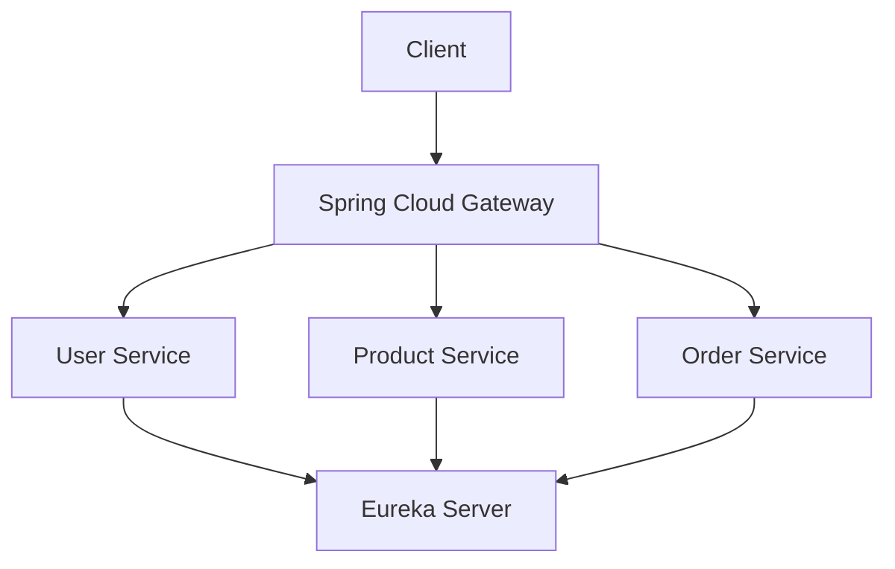

# Java API Gateway Demo

A practical project that demonstrates how to build and integrate an API Gateway into a Java microservices architecture using Spring Boot, Spring Cloud Gateway, and Eureka Service Discovery.

The project is designed as a step-by-step learning exercise that mirrors how API Gateways are implemented in real-world backend systems.

---

## Objectives

The primary goal of this project is to understand:

- Microservices architecture
- API Gateway fundamentals
- Service Discovery with Eureka
- Request routing
- Dynamic service registration
- Service-to-service communication
- Load balancing
- Unit and integration testing

Rather than focusing on business logic, this repository focuses on infrastructure and communication between services.

---

## Architecture



---

## Services

### Discovery Server

Registers every microservice.

Default Port

```text
8761
```

---

### Gateway Service

Acts as the single entry point.

Responsibilities

- Route requests
- Discover services
- Forward requests

Default Port

```
8080
```

---

### User Service

Provides user information.

Default Port

```
8081
```

---

### Product Service

Provides product information.

Default Port

```
8082
```

---

### Order Service

Creates orders and communicates with other services.

Default Port

```
8083
```

---

## Technology Stack

| Technology | Purpose |
|------------|---------|
| Java 25 | Programming Language |
| Spring Boot | Application Framework |
| Spring Cloud Gateway | API Gateway |
| Netflix Eureka | Service Discovery |
| Maven | Build Tool |
| JUnit 5 | Unit Testing |
| Mockito | Mocking Framework |

---

## Project Structure

```text
java-api-gateway-demo/

├── discovery-server/
├── gateway-service/
├── user-service/
├── product-service/
├── order-service/
├── docs/
├── diagrams/
├── scripts/
└── .github/
```

---

## Learning Roadmap

- [x] Repository Setup
- [x] Project Documentation
- [ ] Eureka Discovery Server
- [ ] User Service
- [ ] Product Service
- [ ] Order Service
- [ ] API Gateway
- [ ] Service Communication
- [ ] Testing
- [ ] Docker

---

## Running the Project

Coming soon.

---

## Testing

Coming soon.

---

## License

Licensed under the MIT License.
